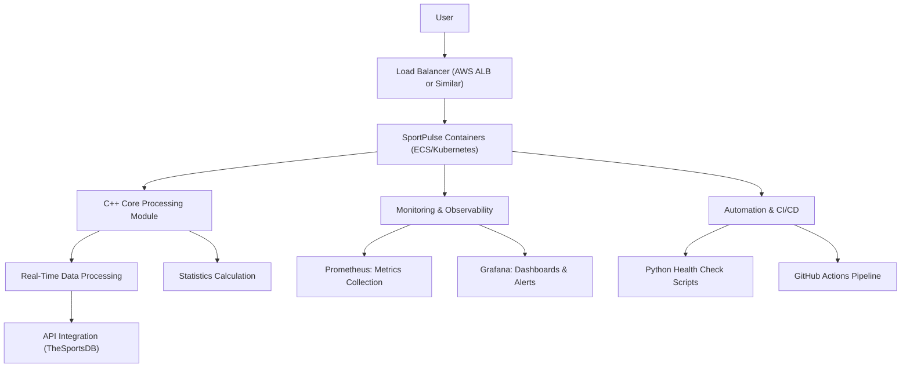
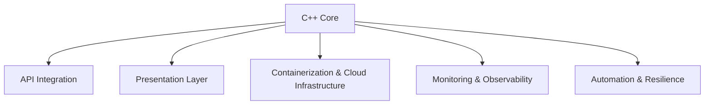

# SportPulse

**SportPulse** is a real-time sports score aggregator built with high-performance C++ and designed following modern architecture and SRE best practices. The system consumes data from the free [TheSportsDB API](https://www.thesportsdb.com), processes live scores and events with sub-500ms latency, and exposes this information through a Command Line Interface (CLI) – with plans for a REST API and interactive web dashboard. Containerized for cloud deployment and integrated with Prometheus/Grafana for monitoring, SportPulse is built to showcase excellence in C++ performance, full-stack development, and site reliability engineering (SRE).

---

## Table of Contents

- [Overview](#overview)
- [Key Features](#key-features)
- [Architecture](#architecture)
- [Detailed Component Breakdown](#detailed-component-breakdown)
- [Getting Started](#getting-started)
  - [Prerequisites](#prerequisites)
  - [Installation](#installation)
- [Usage](#usage)
- [Deployment](#deployment)
  - [Docker Containerization](#docker-containerization)
  - [Cloud Deployment](#cloud-deployment)
- [Monitoring & Observability](#monitoring--observability)
- [Automation & Resilience](#automation--resilience)
- [Future Roadmap](#future-roadmap)
- [Contributing](#contributing)
- [License](#license)
- [Contact](#contact)

---

## Overview

SportPulse is designed to deliver a robust demonstration of:

- **C++ Performance:** High-efficiency processing of live sports data.
- **Full-Stack Development:** Starting with a CLI and planning for a RESTful API and interactive dashboard.
- **Architecture:** A modular, scalable, and maintainable design.
- **SRE Practices:** Integrated monitoring, automated deployments, observability, and resilience testing.

The project not only provides real-time sports analytics for fans and media partners but also serves as a flagship portfolio piece for employers and tech enthusiasts.

---

## Key Features

- **Real-Time Data Ingestion:**  
  Fetches live scores and events from TheSportsDB, updating every 5 seconds.

- **High-Performance Processing:**  
  Utilizes multithreading in C++ (using `std::thread`) to achieve sub-500ms processing latency.

- **Modular Architecture:**  
  Separates core processing, API integration, and presentation layers for clarity and future enhancements.

- **Containerization & Cloud Deployment:**  
  Dockerized for consistent environments and designed for scalable cloud deployments (AWS ECS, DigitalOcean, or Kubernetes).

- **Robust Monitoring & SRE Practices:**  
  Uses Prometheus for metrics collection, Grafana for dashboards, and automated scripts for health checks and recovery.

- **Automated CI/CD Pipeline:**  
  Implements a GitHub Actions pipeline to automate builds, tests, and deployments.

---

## Architecture

### High-Level Architecture Diagram


# Detailed Component Breakdown

## 1. C++ Core

**Responsibility:**  
The C++ core is responsible for the ingestion and processing of live sports data.

**Key Features:**
- Utilizes **libcurl** for HTTP requests.
- Parses JSON responses using **nlohmann/json**.
- Implements multithreading (`std::thread`) for parallel processing.

---

## 2. API Integration

**Responsibility:**  
Handles communication with external services (TheSportsDB), including:
- HTTP calls
- Error handling
- Data validation

---

## 3. Presentation Layer

**CLI Interface:**  
- Provides a Command Line Interface (CLI) for immediate interaction with live scores and statistics.

**Future Expansion:**  
- A planned RESTful API (e.g., GET `/live-scores`) and an interactive web dashboard to increase accessibility and monetization potential.

---

## 4. Containerization & Cloud Infrastructure

**Docker:**  
- The application is containerized to ensure consistent builds and deployment.

**Cloud Deployment:**  
- Deployed on cloud platforms (AWS ECS, DigitalOcean, or Kubernetes) with load balancing and scalability in mind.

---

## 5. Monitoring & Observability

**Prometheus:**  
- Gathers essential metrics such as latency, throughput, and resource usage.

**Grafana:**  
- Visualizes these metrics in real-time dashboards and sets up alerts for critical thresholds.

---

## 6. Automation & Resilience

**CI/CD Pipeline:**  
- Uses GitHub Actions for automated builds, tests, and deployments.

**Health Checks & Auto-Recovery:**  
- Python scripts perform periodic health checks and trigger automatic restarts if failures occur.

**Resilience Testing:**  
- Simulated failure scenarios help validate auto-recovery mechanisms and maintain robust SLIs/SLOs.

---

## Mermaid Diagram: Component Breakdown


---
# Getting Started

## Prerequisites

**Development Tools:**
- C++ compiler (e.g., g++)
- CMake for build automation
- libcurl and nlohmann/json libraries
- Docker for containerization
- Python 3 for automation scripts

**Cloud Account:**
- Access to AWS, DigitalOcean, or another cloud provider for deployment.

## Installation

1. **Clone the Repository:**
```bash
git clone https://github.com/yourusername/SportPulse.git
cd SportPulse
```
2. **Install Dependencies:**
Ensure that libcurl and the JSON library are installed on your system. For example, on Ubuntu:
```bash
sudo apt-get update
sudo apt-get install libcurl4-openssl-dev
# For nlohmann/json, install via package manager or add it as a submodule
```
3. **Build the Project:**
```bash
mkdir build && cd build
cmake ..
make
```
---
# Usage

After building the project, run the CLI application to start fetching and processing live sports data:
```bash
./SportPulse
```
The CLI will output live scores and calculated statistics (e.g., average goals per game) in real time.

---
# Deployment
## Docker Containerization
1. **Build the Docker Image:**
Create a Dockerfile with the following sample content:
```dockerfile
# Use an official Ubuntu base image
FROM ubuntu:20.04

# Install necessary packages
RUN apt-get update && apt-get install -y \
    build-essential \
    libcurl4-openssl-dev \
    cmake \
    git

# Copy the source code into the container
COPY . /app
WORKDIR /app

# Build the application
RUN mkdir build && cd build && cmake .. && make

# Set the entry point to run the application
ENTRYPOINT ["./build/SportPulse"]
```
2. **Build the Docker image:**
```bash
docker build -t sportpulse:latest .
```
3. **Push to Docker Hub:**
```bash
docker tag sportpulse:latest yourdockerhubusername/sportpulse:latest
docker push yourdockerhubusername/sportpulse:latest
```
---
## Cloud Deployment
Deploy the Docker container to your preferred cloud provider (e.g., AWS ECS, DigitalOcean, or Kubernetes). Ensure the deployment includes load balancing, health checks, and auto-scaling configurations.

---
# Monitoring & Observability

**Prometheus:**
- Configure Prometheus to scrape metrics from SportPulse.
- Expose endpoints in your application that provide key performance data.

**Grafana:**
- Create dashboards to visualize metrics such as API response latency, update frequency, and system resource usage.

**Alerting:**
- Set up alert rules to notify on critical events (e.g., API downtime, high latency).
---
# Automation & Resilience
**CI/CD Pipeline:**
- Utilize GitHub Actions to automate the build, test, and deployment processes. This ensures every commit is verified and deployed seamlessly.

**Health Check Scripts:**
- Implement Python scripts to perform periodic health checks and restart the application if necessary.
- These scripts are integrated with the CI/CD pipeline and cloud deployment.

**Resilience Testing:**
- Regularly simulate failures (e.g., API downtime, load spikes) to test and improve the system's auto-recovery capabilities.
- Document SLIs/SLOs based on these tests.

---
# Future Roadmap
- **REST API & Web Dashboard:**
Develop a RESTful API endpoint and a modern web dashboard to provide enhanced user interaction and analytics.

- **Advanced Analytics:**
Add features for detailed statistical analysis and predictive insights on sports events.

- **Mobile Application:**
Consider developing a mobile app to allow users to access live scores on the go.

- **Monetization:**
Explore integration of ad networks or premium subscription models to monetize the platform.

---
# Contributing
Contributions are welcome!

To contribute:

Fork the repository.
Create a feature branch.
Make your changes and ensure they follow our coding standards.
Submit a pull request for review.
For issues or feature requests, please use the GitHub issues tracker.

---
# License
This project is licensed under the MIT License – see the LICENSE file for details.

---
# Contact
For inquiries, collaboration, or further information, please reach out:

YouTube Channel: [Dionisio Developer](https://www.youtube.com/@dionisiodev)  
Twitter: [@dionisiodev](https://www.x.com/dionisiodev)  
Email: ceduardodfernandes@gmail.com  
GitHub: [@dionisioedu](https://github.com/dionisioedu)  
